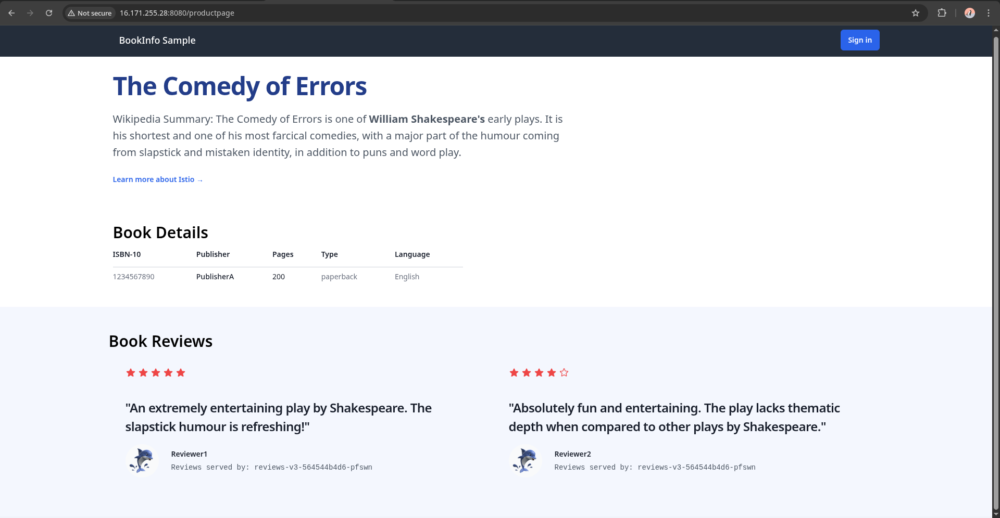
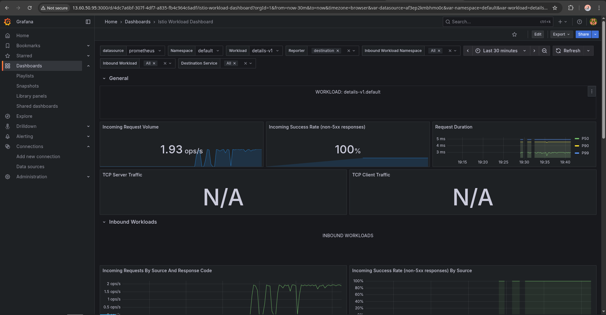
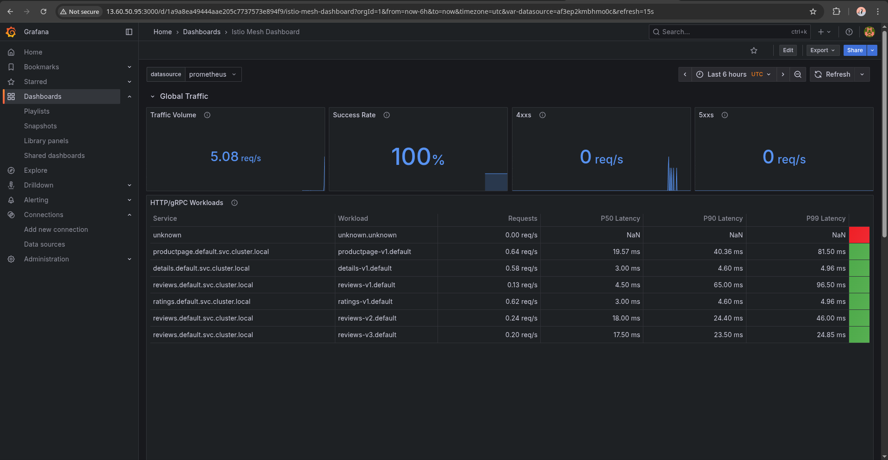
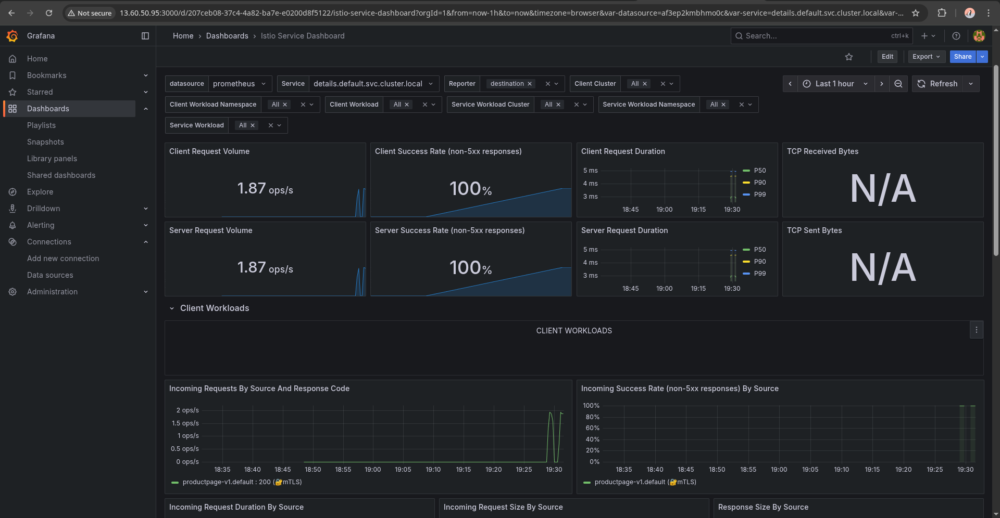
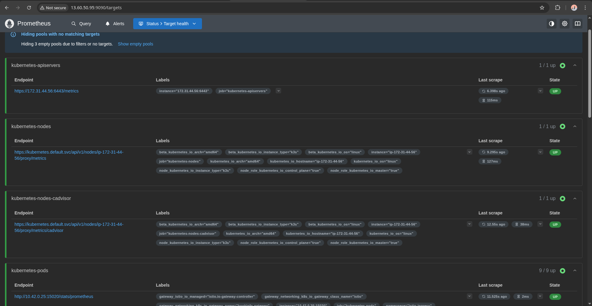

# Istio Microservices Observability Platform

> Production-grade service mesh deployment on Kubernetes (k3s) with comprehensive monitoring using Prometheus and Grafana on AWS EC2.

[](https://kubernetes.io/)
[](https://istio.io/)

---

## 🎯 Project Overview

This project demonstrates enterprise-grade microservices architecture using **Istio service mesh** for traffic management and observability. The implementation showcases DevOps best practices including infrastructure automation, monitoring, and cloud deployment.

### What This Project Demonstrates

- ✅ **Service Mesh Architecture** - Istio control plane and Envoy proxy sidecars
- ✅ **Microservices Deployment** - Polyglot services (Python, Java, Ruby, Node.js)
- ✅ **Traffic Management** - Intelligent routing with VirtualServices and Gateways
- ✅ **Observability Stack** - Prometheus metrics collection + Grafana visualization
- ✅ **Cloud Infrastructure** - k3s Kubernetes on AWS EC2
- ✅ **Infrastructure as Code** - Helm charts and declarative YAML configs

---

## 📊 Live Application & Monitoring

### Bookinfo Application

The Bookinfo application simulates a real-world microservices deployment with:
- **Product Page** (Python) - Frontend aggregating data
- **Details Service** (Ruby) - Book information
- **Reviews Service** (Java) - Book reviews with 3 versions
- **Ratings Service** (Node.js) - Star ratings


*Application showing dynamic review versions*

---

### Monitoring Dashboards

#### Grafana Overview

*Grafana showing imported Istio workload dashboard*

#### Istio Mesh Dashboard

*Service mesh health: request rates, latencies, error rates*

**Key Metrics Displayed:**
- Total requests per second across the mesh
- Success rate (2xx responses)
- P50, P95, P99 latency percentiles
- Error rates by service

#### Istio Service Dashboard

*Per-service metrics: productpage, details, reviews, ratings*

**Shows:**
- Request volume per service
- Response time distribution
- Error rates breakdown
- Upstream/downstream dependencies

#### Prometheus Metrics

*Raw metrics collection and query interface*

**Prometheus Targets:**
- Envoy sidecar proxies in each pod
- Istio control plane (istiod)
- Application metrics endpoints

---

***

## What I Learned (The Honest Part)

**Problems I Actually Solved:**

1. **k3s kube-proxy missing** - k3s uses ServiceLB instead of traditional kube-proxy. NodePort wasn't working initially. Fixed it.

2. **Envoy proxy not listening on port 8080** - Pod was running but port-forward failed with "connection refused". Root cause: Gateway resource wasn't configured, so Envoy had no listeners. Fixed by applying proper Gateway + VirtualService config.

3. **Service ports vs target ports** - Service had port 80 → targetPort 80 mapping, but Envoy listens on 8080. Fixed by correcting to port 80 → targetPort 8080.

4. **Kubernetes Gateway API vs Istio API** - K8s Gateway API has different syntax (`hostname: "*"` vs `hosts: ["*"]`). Old Istio API was simpler and more stable for this project because of k3s.

***

## 🚀 Deployment

### Prerequisites

- AWS account with EC2 access
- t3.medium instance (2 vCPU, 4GB RAM minimum)
- Ubuntu 22.04 or 24.04 LTS
- Security group allowing ports: 22, 80, 443, 6443, 30000-32767

**Install k3s:**
```bash
curl -sfL https://get.k3s.io | INSTALL_K3S_EXEC="--disable traefik --kube-proxy-arg=mode=iptables" sh -
```

**Install Istio (Helm):**
```bash
helm repo add istio https://istio-release.storage.googleapis.com/charts
helm repo update
kubectl create namespace istio-system
helm install istio-base istio/base -n istio-system 
helm install istiod istio/istiod -n istio-system 
```

